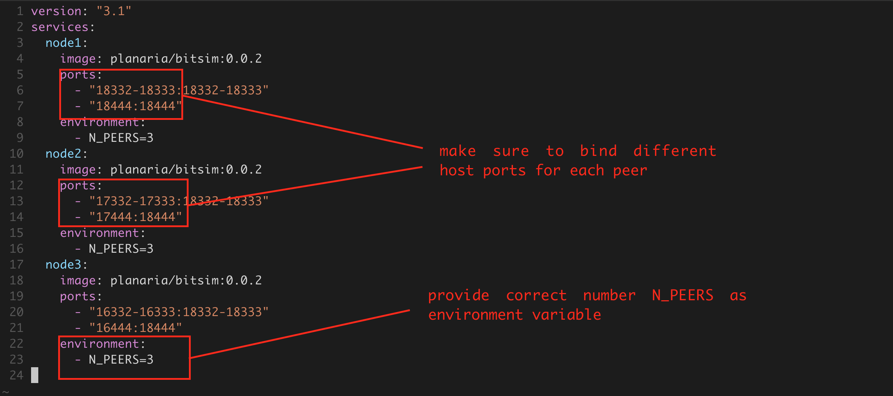

# Bitsim Node

> Bitcoin Simulation Node 

# About

Bitsim is a 'bitcoin node in a box' meant for mocking test scenarios. 

Bitsim is slightly different from regular regtest mode, because it supports: 
- mainnet addresses
- mainnet magic bytes

# Instructions

## Basic

```bash
# pull image
docker pull planaria/bitsim:0.0.2

# start node
docker run -d -p 18332-18333:18332-18333 planaria/bitsim:0.0.2

# hit RPC 
bitcoin-cli -rpcport=18332 help

# validate address
bitcoin-cli -rpcport=18332 validateaddress "1DzqBck9oyCBzxJbbje2s15deZis6BeATi"

# mine blocks
bitcoin-cli -rpcport=18332 generatetoaddress 3 "1DzqBck9oyCBzxJbbje2s15deZis6BeATi"
```

## For Use in Network Mode

Multple Bitsim nodes can be easily configured to talk together to create more complex simulations. This can be done easily with various container orchestration solutions. 

### Try Example

```bash
# pull image and start network of 3 Bitsim nodes
curl https://raw.githubusercontent.com/interplanaria/bitsim/master/docker-compose.yml > docker-compose.yml && docker-compose up
```

### Create Your Own

#### Docker-Compose

Create your own [docker-compose](https://docs.docker.com/compose/) file.  

You must: 

- Supply total `N_PEERS` as environment variable to each container
- Use name format `node1`, `node2`, etc..



#### Kubernetes Template

Create your own Kubernetes Tempalate.

You must: 
- [Stateful Set](https://kubernetes.io/docs/concepts/workloads/controllers/statefulset/) is required
- Create seperate template for each node
- Supply total `N_PEERS` as environment variable to each container
- Use name format `node1`, `node2`, etc. for each Stateful Set


